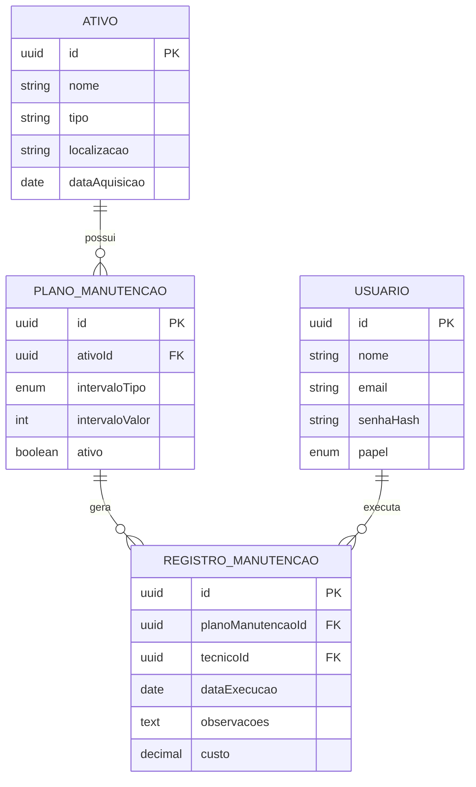
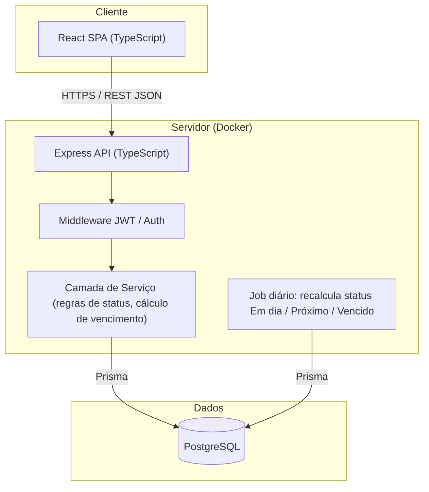

# 02 — Arquitetura e Modelo de Dados: Equipment Maintenance Tracker

## Stack Final

| Camada | Escolha |
|---|---|
| Frontend | React + TypeScript + Vite (SPA) |
| Backend | Node.js + Express + TypeScript |
| ORM | Prisma |
| Banco de dados | PostgreSQL |
| Autenticação | JWT (sessão stateless), senha com hash bcrypt |
| Containerização | Docker + docker-compose (app + db) |
| CI | GitHub Actions (lint + test) |

## Modelo de Dados (Entidades)

### Usuario
| Campo | Tipo | Notas |
|---|---|---|
| id | UUID (PK) | |
| nome | string | |
| email | string | único |
| senhaHash | string | bcrypt, nunca texto plano (RNF02) |
| papel | enum | `TECNICO`, `SUPERVISOR`, `GESTOR` |
| criadoEm | timestamp | |

### Ativo
| Campo | Tipo | Notas |
|---|---|---|
| id | UUID (PK) | |
| nome | string | |
| tipo | string | ex: bomba, gerador, veículo |
| localizacao | string | |
| dataAquisicao | date | |
| criadoEm | timestamp | |

### PlanoManutencao
| Campo | Tipo | Notas |
|---|---|---|
| id | UUID (PK) | |
| ativoId | UUID (FK → Ativo) | |
| intervaloTipo | enum | `DIAS` ou `HORAS_USO` |
| intervaloValor | int | ex: 90 (dias) ou 500 (horas) |
| proximoVencimento | date/derivado | calculado a partir do último `RegistroManutencao` ou `dataAquisicao` |
| ativo | boolean | permite desativar plano sem apagar histórico |

### RegistroManutencao
| Campo | Tipo | Notas |
|---|---|---|
| id | UUID (PK) | |
| planoManutencaoId | UUID (FK → PlanoManutencao) | |
| tecnicoId | UUID (FK → Usuario) | |
| dataExecucao | date | |
| observacoes | text | |
| custo | decimal | RNF02: nunca exposto sem autenticação |
| criadoEm | timestamp | |

## Diagrama ER

## Diagrama de Arquitetura (Camadas)

## Cálculo de Status (regra de negócio central)

Status de um `PlanoManutencao` é **derivado**, não armazenado diretamente:

1. `proximoVencimento` = data do último `RegistroManutencao` + intervalo (ou `dataAquisicao` + intervalo, se nunca houve execução)
2. Se `hoje > proximoVencimento` → **Vencido**
3. Se `proximoVencimento - hoje <= X dias` (configurável, default 7) → **Próximo do vencimento**
4. Caso contrário → **Em dia**

Essa regra roda tanto na consulta (listagem, RF04) quanto no job diário que popula o painel de alertas (RF05).

## Architecture Decision Records (ADR)

### ADR-001: PostgreSQL em vez de SQL Server ou MongoDB
**Contexto:** dados são fortemente relacionais (Ativo → Plano → Registro), com necessidade de integridade referencial e queries agregadas (RF06, relatórios de custo).
**Decisão:** PostgreSQL.
**Motivos:**
- Dados relacionais com FKs claras — SQL encaixa melhor que NoSQL (descarta MongoDB)
- Open source, roda em Docker sem custo de licença (descarta SQL Server para portfolio pessoal)
- Prisma tem suporte de primeira classe a Postgres
**Consequências:** exige Docker Compose com serviço de banco; migrations via Prisma Migrate.

### ADR-002: Status derivado em vez de campo armazenado
**Contexto:** RF04 exige listar status atual (Em dia/Próximo/Vencido).
**Decisão:** calcular o status em tempo de leitura a partir de datas, não gravar uma coluna `status` no banco.
**Motivos:**
- Evita inconsistência (campo `status` desatualizado se ninguém rodar o job)
- Simplifica escrita — só `RegistroManutencao` é gravado, status é sempre reflexo fiel da data atual
**Consequências:** query de listagem precisa de lógica de cálculo (na camada de serviço ou view SQL); leve custo de CPU, aceitável para RNF01 (<1s com 1.000 registros).

### ADR-003: Alertas apenas no painel no MVP (sem envio de e-mail real)
**Contexto:** RF05 pede alerta por painel + e-mail.
**Decisão:** implementar o alerta no painel (via status "Próximo do vencimento"); envio de e-mail fica com um `NotificationService` com interface pronta, mas implementação mock/log no MVP.
**Motivos:**
- Remove dependência de serviço externo (SMTP/SendGrid) do escopo inicial, reduzindo complexidade e custo do portfolio
- Interface do serviço já desenhada para não bloquear evolução futura (basta trocar a implementação mock por um provedor real)
**Consequências:** critério de aceite "e-mail de alerta é disparado automaticamente" é satisfeito via log estruturado no MVP; e-mail real fica como próxima iteração pós-MVP.

### ADR-004: Autenticação JWT stateless em vez de sessão em banco
**Contexto:** RF07 pede login/autenticação básica.
**Decisão:** JWT assinado, sem tabela de sessão.
**Motivos:**
- Simplicidade para MVP de portfolio, sem necessidade de escalar múltiplas instâncias ainda
- Evita tabela extra de sessões; papel do usuário (`TECNICO`/`SUPERVISOR`/`GESTOR`) embutido no token para controle de acesso
**Consequências:** revogação de token antes da expiração não é suportada no MVP (aceitável, expiração curta mitigada).

## Próximo passo
Etapa 3 — Backlog de user stories e divisão em sprints.
